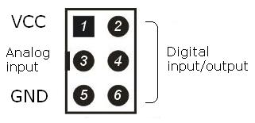

# Porty w nakładce zestawu Inteligentne Miasto

<table border="1" cellpadding="5" align="center">
<tr align="center">
  <td rowspan="2"></td>
  <td colspan="2">Zasilanie</td>
  <td colspan="4">Piny Arduino UNO</td>
</tr>
<tr align="center">
  <td>VCC</td>
  <td>GND</td>
  <td>Wejście analogowe</td>
  <td colspan="3">Wejścia/Wyjścia cyfrowe</td>
</tr>
<tr align="center">
  <td width="120">Piny w złączu IDC</td>
  <td width="80">1</td>
  <td width="80">5</td>
  <td width="80">3</td>
  <td width="80">6</td>
  <td width="80">4</td>
  <td width="80">2</td>
</tr>
<tr align="center">
  <td>Port 0</td>
  <td>+5 V</td>
  <td>0 V</td>
  <td>A0</td>
  <td>D2</td>
  <td>D3</td>
  <td>D4</td>
</tr>
<tr align="center">
  <td>Port 1</td>
  <td>+5 V</td>
  <td>0 V</td>
  <td>A1</td>
  <td>D5</td>
  <td>D6</td>
  <td>D7</td>
</tr>
<tr align="center">
  <td>Port 2</td>
  <td>+5 V</td>
  <td>0 V</td>
  <td>A2</td>
  <td>D8</td>
  <td>D9</td>
  <td>D10</td>
</tr>
<tr align="center">
  <td>Port 3</td>
  <td>+5 V</td>
  <td>0 V</td>
  <td>A3</td>
  <td>D11</td>
  <td>D12</td>
  <td>D13</td>
</tr>
</table>

Opracowane na podstawie analizy kodu programu **Inteligentne Miasto** [link] (http://cyfrowyodkrywca.pl/InteligentneMiasto/jak-to-dziala/#do_pobrania) i analizy płytki PCB nakładki (*shield'u*) na Arduino.

